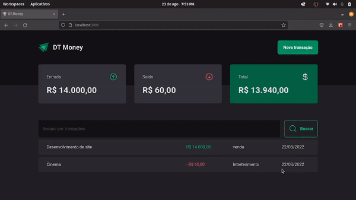

<h1 align="center">
    DT.Money
</h1>

<h1 align="center">
     
</h1>

## 🏷️ Sobre 
**DT.Money**: é uma aplicação onde você pode cadastrar seus gastos e ganhos e ter um controle personalizado de suas finaças.


## Foco do aprendizado:
- [x] Consumo de API com axios para buscar os dados
- [x] Simular uma API vinda do back-end utilizando Json-server
- [x] Context API
- [x] Lógica para calcular as entradas e saídas utilizando **reduce**
- [x] Performace utilizando **memo**, **useMemo** e **useCallback**
- [x] Modal com toda a parte de acessibilidade já pronta e da melhor forma possível utilizando **radix ui**
---

## 🛠️ Tecnologias e serviços utilizados
Foram utilizadas as seguintes tecnologias para desenvolver a aplicação **DT.Money** :

- [HTML5](https://html.com/)
- [React.js](https://pt-br.reactjs.org/)
- [Typescript](https://www.typescriptlang.org/)
- [Styled-components](https://styled-components.com/)
- [Json-server](https://github.com/typicode/json-server)
- [Radix-ui](https://www.radix-ui.com/)
- [React-hook-form](https://react-hook-form.com/)
- [use-context-selector](https://github.com/dai-shi/use-context-selector)

---

## 🗂️ Como baixar e iniciar o projeto 

```bash

    #clonar o projeto
    $ git clone https://github.com/ElisioWander/dt-money.git

    #entrar no diretório
    $ cd dt-money

    #instalar as dependências
    $ npm install

    #iniciar a aplicação
    $ npm run dev

    #iniciando servidor para API
    $ npm run dev:server
```
### Servidor local
localhost:3000 para o app
localhost:3333 para a API

---

## Autor
### 👤 Elisio Wander

- Linkedin: [@elisioWander](https://www.linkedin.com/in/elisio-wander-b88b69136/)
- Github: [@elisioWander](https://github.com/ElisioWander)
- Site: [elisiowander.vercel.app](https://elisiowander.vercel.app)

---
## 📝 Licença
Copyright © 2020 [@ElisioWander](https://github.com/ElisioWander/dt-money/blob/main/LICENSE)

Este projeto está sobe a [LICENÇA MIT](https://opensource.org/licenses/MIT)

---

### Desenvolvido 💜 by Elisio Wander
